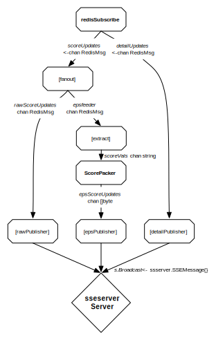

emojitrack-gostreamer
=====================

Implementation of an API compatible server for
the [Emojitracker Streaming API Specification][1] in Go.

Caveats
-------

This was originally my first major Go project, so there may potentially still
be some silly stuff left in the code here.

Pipeline Flow
-------------

Goroutines and channels make it just too much fun to think about things as flow
diagrams.  This is the essential pipeline for information flow in the `main()`
function for the program.

Package sseserver
-----------------

This program doesn't actually do too much beyond the pipeline flow above, as all
of the SSE/HTTP server logic has been extracted into a handy modular package
that should be usable for any generic SSE broadcasting.  For that stuff, delve
into the (freely licensed!) [sseserver](https://github.com/mroth/sseserver/)
repo.

Development
-----------

A sandbox environment is provided to test via Docker Compose, using
[emojitrack/fakefeeder](https://github.com/emojitracker/emojitrack-fakefeeder)
to simulate production traffic.

Simply run `docker compose up` and you'll have a local environment to test
against, with the streamer exposed on port 8001. Try `curl
http://localhost:8001/subscribe/eps` for example.

Production
----------

Currently handled on Heroku, to add remotes manually after cloning the repository:

    heroku git:remote --remote production emojitrack-gostreamer
    heroku git:remote --remote staging emojitrack-gostreamer-staging

Simply git pushing to either will build and update.

Is it any fast?
---------------

Yes.:racehorse:

[1]: http://github.com/mroth/emojitrack-streamer-spec
